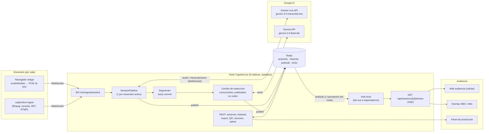
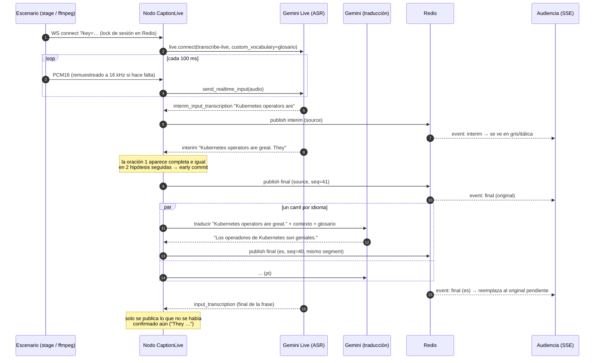
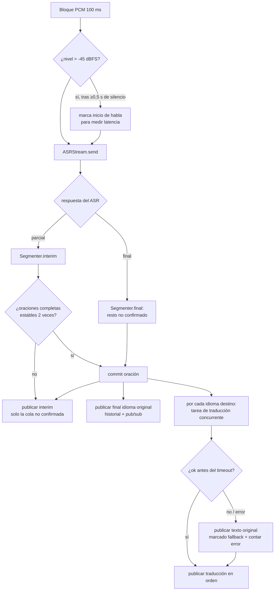

# Arquitectura de CaptionLive

## 1. Objetivos de diseño

Los criterios de la Vibeathon marcan las prioridades:

| Criterio | Decisión de diseño |
|---|---|
| **Calidad** (términos técnicos) | ASR especializado (`gemini-3.5-transcribe-live`) con **vocabulario personalizado** (glosario por sesión); traducción con contexto de las oraciones previas y glosario "no traducir" |
| **Latencia** | Streaming de audio en bloques de 100 ms, subtítulos parciales inmediatos, **early commit** de oraciones estables para traducir sin esperar la pausa del orador |
| **Escalabilidad** | Un pipeline asíncrono (sin threads ni GPU) por escenario; nodos web **stateless**; Redis para estado compartido y fan-out; SSE para la audiencia |
| **Facilidad de despliegue** | Un solo proceso/imagen Docker, sin build de frontend, configuración 100 % por variables de entorno, `docker compose up` o un script para Cloud Run |
| **Costo** | Modelos más baratos que cumplen (ASR ≈ US$ 0,009/min; traducción de texto con Flash-Lite, centavos por hora); sin servidores de medios ni GPUs |
| **Open source** | Apache-2.0, proveedores intercambiables, modo 100 % local con Whisper + Gemma |

## 2. Stack elegido y por qué

| Capa | Tecnología | Por qué | Alternativas descartadas |
|---|---|---|---|
| Reconocimiento de voz (ASR) | **Gemini Live API** con `gemini-3.5-transcribe-live` | Modelo específico de transcripción en streaming: resultados parciales y finales, 85+ idiomas, detección automática, `custom_vocabulary` para términos técnicos, ≈ US$ 0,009/min | Modelos Live conversacionales (generan respuestas que no necesitamos y cuestan más); Live Translate speech-to-speech (≈ US$ 0,037/min por idioma, audio que no necesitamos, un idioma por conexión) |
| Traducción (MT) | **Gemini** `gemini-2.5-flash-lite` (configurable) | Texto→texto por oración: una sola transcripción alimenta **N idiomas**; muy barato; controlable con glosario y contexto; sin "thinking" para baja latencia | Traducir el audio N veces (costo × N); traducción por palabra/parcial (inestable, cara) |
| Modo local | **faster-whisper** + **Gemma** vía Ollama (API OpenAI-compatible) | Eventos sin internet o con datos sensibles; mismo pipeline | — |
| Backend | **Python 3.11+ / FastAPI / Uvicorn (asyncio)** | SDK oficial `google-genai` con soporte Live; asyncio maneja cientos de WebSockets/streams por proceso; ecosistema de audio (numpy) | Node.js (igual de válido, pero el SDK y las herramientas de audio/ML de Python son más completas) |
| Ingesta de audio | **WebSocket** con PCM16 mono 16 kHz | Simple, funciona desde el navegador y desde `ffmpeg` (consola, SRT, RTMP, HLS) | WebRTC (requiere SFU/TURN, mucha más operación) |
| Entrega a la audiencia | **Server-Sent Events (SSE)** | HTTP puro: atraviesa proxies/CDN, reconexión y reanudación nativas (`Last-Event-ID`), una conexión liviana por espectador | WebSocket (bidireccional innecesario, más difícil de balancear/cachear) |
| Estado y fan-out | **Redis** (opcional) | Pub/Sub para repartir eventos a todos los nodos, listas acotadas para historial, lock por sesión para una sola fuente de audio | Kafka/NATS (sobredimensionado); base SQL (no necesaria) |
| Frontend | **HTML + CSS + ES modules**, sin build | Cero toolchain para desplegar; carga instantánea en el celular; AudioWorklet para capturar audio | React/Vite (más peso y pasos de build sin beneficio real aquí) |
| Observabilidad | **Prometheus** `/metrics` + panel propio | Latencias (histogramas), errores, costo estimado, audiencia | — |
| Empaquetado | **Docker**, Compose, Cloud Run, Kubernetes | Un contenedor para todo | — |

## 3. Vista de componentes



Con `CL_BROKER=memory` Redis desaparece y todo vive en un proceso (ideal para desarrollo
o eventos chicos); con `CL_BROKER=redis` se pueden correr tantas réplicas como se quiera
detrás de cualquier balanceador, **sin sticky sessions**.

## 4. Flujo de un subtítulo (secuencia)



## 5. Pipeline por escenario



Detalles clave:

- **Early commit** (`captionlive/segmenter.py`): los oradores hablan 15–20 s sin pausa; si
  se esperara el final del ASR, la traducción llegaría muy tarde. Una oración se confirma
  cuando está completa y aparece idéntica en dos hipótesis parciales consecutivas; al llegar
  el final, se descuentan las palabras ya confirmadas.
- **Traducción ordenada**: cada idioma tiene un "carril": las traducciones se lanzan en
  paralelo pero se publican en el orden del discurso aunque respondan desordenadas.
- **Degradación elegante**: si la traducción falla o excede `CL_MT_TIMEOUT_SECONDS`, se
  muestra el original (marcado) en lugar de dejar un hueco, y el error aparece en el panel.
- **Rotación sin pérdida** (`captionlive/asr/gemini_live.py`): las sesiones Live tienen
  duración máxima (10 min en transcribe-live). CaptionLive abre la conexión nueva *antes* de
  cerrar la vieja, preferentemente en una pausa del orador, le envía `audio_stream_end` a la
  vieja y la drena para no perder la frase en curso. Si la red se corta, el audio se buffera
  (hasta 60 s) y se reenvía al reconectar con back-off exponencial.
- **Contexto y glosario**: la traducción recibe las 3 oraciones anteriores (coherencia,
  pronombres) y el glosario de la sesión (términos que se mantienen como los usa la comunidad).

## 6. Escalabilidad

| Recurso | Cómo escala |
|---|---|
| Escenarios en paralelo | Cada escenario es un pipeline `asyncio` (I/O-bound). En la prueba de carga, **30 escenarios + 600 espectadores** usaron ~4 % de un core y ~95 MB de RAM en un solo proceso (ver [PRUEBAS.md](PRUEBAS.md)). Con Redis, los escenarios se reparten entre réplicas automáticamente (cada ingesta cae en cualquier nodo). |
| Espectadores | SSE sobre HTTP. Cada nodo tiene **una** suscripción a Redis y reparte localmente; agregar réplicas agrega capacidad lineal. Los clientes lentos no frenan el pipeline (colas acotadas que descartan lo más viejo). |
| Idiomas | Una sola transcripción por escenario; cada idioma extra es solo una llamada de texto barata por oración. |
| Límites de API | ASR: 1 conexión Live por escenario. MT: ≈ 10 req/min por idioma por escenario (30 salas × 2 idiomas ≈ 600 RPM → pedir cuota acorde o usar Vertex AI). |
| Una sola fuente por sala | Lock en Redis con TTL (15 s) renovado cada 5 s; `takeover=1` permite reemplazar la fuente (p. ej. cambiar de notebook) sin intervención manual. |

## 7. Costos estimados

Precios de referencia (septiembre 2026; verificar en la página de precios de Gemini):
ASR `gemini-3.5-transcribe-live` ≈ **US$ 0,009/min**; `gemini-2.5-flash-lite` US$ 0,10 /
0,40 por millón de tokens de entrada/salida.

| Concepto | Por hora de charla |
|---|---|
| Transcripción (ASR) | ≈ US$ 0,54 |
| Traducción por idioma (≈ 600 oraciones, ~250 tokens de prompt c/u) | ≈ US$ 0,02–0,03 |
| Infraestructura (Cloud Run 1 vCPU sirve decenas de salas) | < US$ 0,05 por sala |
| **Total aprox. (original + 2 idiomas)** | **≈ US$ 0,60 / hora / sala** |

Ejemplo Nerdearla: 30 salas × 8 h × 2 idiomas ≈ **US$ 150 por día** para ~240 horas de charla
subtitulada. Los **US$ 25 de créditos** alcanzan para ~40 horas de audio. El modo local
(Whisper + Gemma) tiene costo de API cero a cambio de hardware propio (idealmente GPU).

El panel muestra el costo estimado acumulado por sesión (`CL_ASR_COST_PER_MINUTE`,
`CL_MT_COST_PER_1K_CHARS` para ajustar).

## 8. Latencia

Medida por el sistema y visible en el panel/Prometheus:

- **Primer subtítulo** (`captionlive_first_caption_seconds`): desde que el nivel de audio
  indica inicio de habla hasta el primer parcial publicado.
- **Traducción** (`captionlive_translation_seconds`): desde que una oración se confirma
  hasta que su traducción se publica.

Presupuesto típico con Gemini: parciales del original en < 1 s; traducciones ≈ duración de la
oración + 0,3–0,8 s de MT (sin early commit sería hasta el final de la frase larga + MT).
Mientras llega la traducción, la vista de audiencia muestra el original en vivo en gris
(desactivable), así nadie ve una pantalla quieta.

## 9. Seguridad y privacidad

- Panel y API de administración protegidos por `CL_ADMIN_TOKEN` (comparación en tiempo
  constante). La vista de audiencia es pública por diseño.
- Cada sesión tiene su **clave de ingesta** (rotable) para que nadie inyecte audio.
- El audio no se guarda: solo el texto (historial acotado por `CL_HISTORY_SIZE`).
- Para datos sensibles: modo 100 % local.

## 10. Estructura del código

```
captionlive/
  main.py           API FastAPI: páginas, REST, SSE, WebSocket de ingesta
  pipeline.py       Pipeline por escenario (ASR → segmenter → MT → broker), métricas
  segmenter.py      Early commit de oraciones estables
  broker.py         MemoryBroker / RedisBroker: sesiones, historial, pub/sub, locks, estado
  asr/              gemini_live.py (default) · whisper_local.py · mock.py
  mt/               gemini.py (default) · openai_compat.py (Gemma/Ollama/vLLM) · mock.py
  export.py         SRT / VTT / TXT
  audio.py          remuestreo, nivel dBFS
  cli.py            serve · ingest (ffmpeg) · simulate (carga)
  web/              index (audiencia) · stage · admin · overlay (OBS/vMix)
```
